

# Gangadhar's Traffic Sign Recognition using Neural Network

**Building a Traffic Sign Recognition Project**

The goals / steps of this project are the following:
* Load the data set (see below for links to the project data set)
* Explore, summarize and visualize the data set
* Design, train and test a model architecture
* Use the model to make predictions on new images
* Analyze the softmax probabilities of the new images
* Summarize the results with a written report

### Files Submitted
----
The project submission includes the below file.
* Ipython notebook [Jupyter Notebook](https://github.com/geekay2015/CarND-Traffic-Sign-Classifier-Project/blob/master/Traffic_Sign_Classifier.ipynb)

* HTML output of the code [HTML Output](https://github.com/geekay2015/CarND-Traffic-Sign-Classifier-Project/blob/master/Traffic_Sign_Classifier.html)

* A writeup report [My Project writeup](https://github.com/geekay2015/CarND-Traffic-Sign-Classifier-Project/blob/master/writup.md)

### Dataset Exploration
----

#### Dataset Summary
I used the numpy library to calculate summary statistics of the traffic signs data set:
* The size of training set is 34799
* The size of test set is 12630
* The shape of a traffic sign image is (32, 32, 3)
* The number of unique classes/labels in the data set is 43

#### Exploratory visualization
Here is an exploratory visualization of the data set. 
It pulls in a random set of eight images and labels them with the correct names in reference with the csv file to their respective id's.

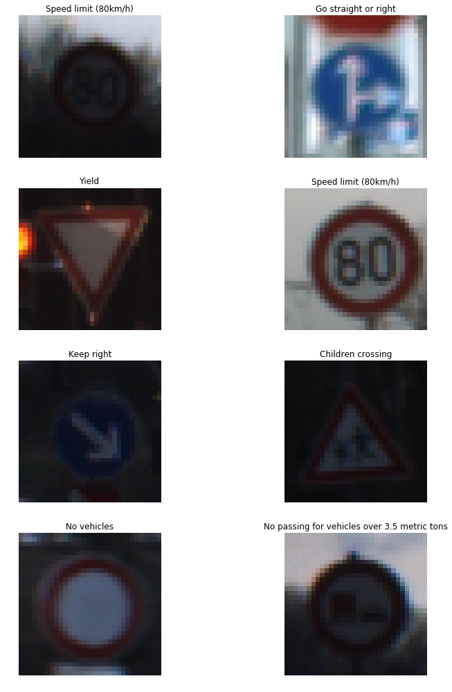

## Data Distribution to check the potential pitfall
After this point I also detail the dataset structure by plotting the occurrence of each image class to get an idea of how the data is distributed. This can help understand where potential pitfalls could occur if the dataset isn't uniform in terms of a baseline occurrence.

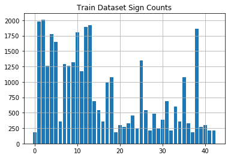

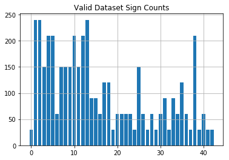

### Design and Test a Model Architecture
----

#### Preprocessing Techniques useed
I used below proeprocessing techniques:
1. At first I tried to convert it to YUV as that was what the technical paper described that was authored by Pierre Sermanet and Yann LeCun. I had difficulty getting this working at so I skipped over this in order to meet my time requirements.

2. grayscaling 
The next step, I decided to convert the images to grayscale because in the technical paper it outlined several steps they used to achieve 99.7%. I assume this works better because the excess information only adds extra confusion into the learning process. After the grayscale I also normalized the image data because I've read it helps in speed of training and performance because of things like resources. Also added additional images to the datasets through randomized modifications.

Here is an example of a traffic sign images that were randomly selected.

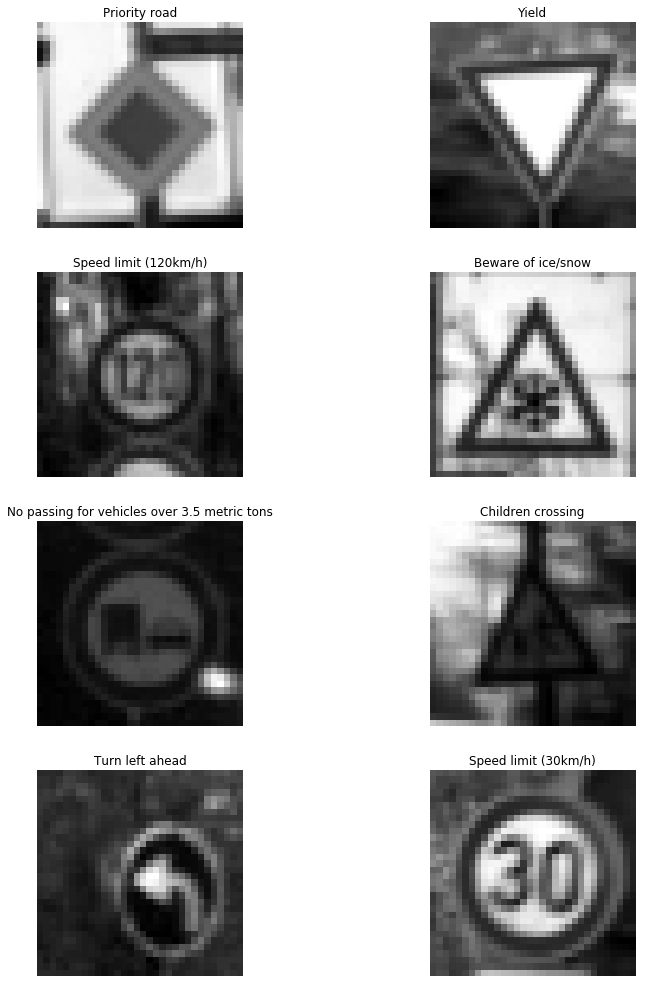

Here is a look at the normalized images. Which should look identical, but for some small random alterations such as opencv affine and rotation.

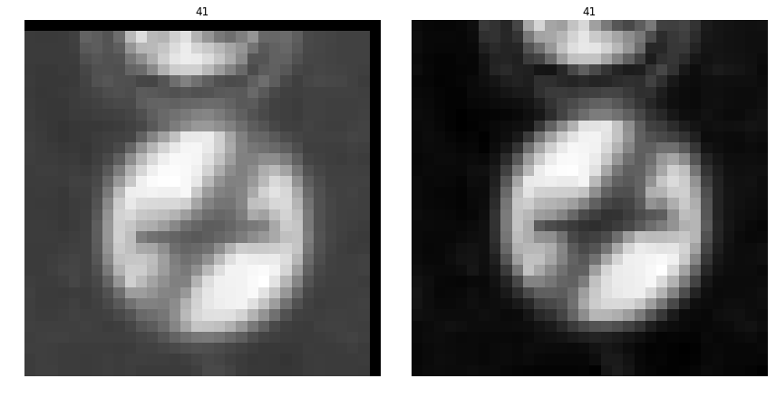

#### Model Architecture
1. Details of the characteristics and qualities of the architecture, 
2. including the type of model used, the number of layers, 
3. and the size of each layer. 
4. Visualizations emphasizing particular qualities of the architecture are encouraged.
At first I wasn't going to do this part because I didn't have enough time, but I took an extra day and decided to turn this in on the 28th rather then the 27th. I did a few random alterations to the images and saved multiple copies of them depending on the total images in the dataset class type.

#### Model Training
The submission describes how the model was trained by discussing what optimizer was used, batch size, number of epochs and values for hyperparameters.

#### Solution Approach
The submission describes the approach to finding a solution. Accuracy on the validation set is 0.93 or greater.

### Testing my model on New images
----
#### Acquiring New Images
The submission includes five new German Traffic signs found on the web, and the images are visualized. Discussion is made as to particular qualities of the images or traffic signs in the images that are of interest, such as whether they would be difficult for the model to classify.
Here is an example of 1 image I changed at random. More can be seen further in the document, but the original is on the right and the randomized opencv affine change is on the left. Small rotations are also visible further along as stated.

#### Performance on New Images
The submission documents the performance of the model when tested on the captured images. The performance on the new images is compared to the accuracy results of the test set.

#### Model Certainty - Softmax Probabilities
The top five softmax probabilities of the predictions on the captured images are outputted. The submission discusses how certain or uncertain the model is of its predictions.

I increased the train dataset size to 89860 and also merged and then remade another validation dataset.  Now no image class in the train set has less then 1000 images

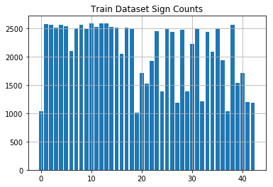

Validation set gained 20% of the original total mentioned above.  I did this using scikit learns train test split method.

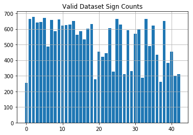

I increased the train dataset size to 89860 and also merged and then remade another validation dataset. Now no image class in the train set has less then 1000 images. Test

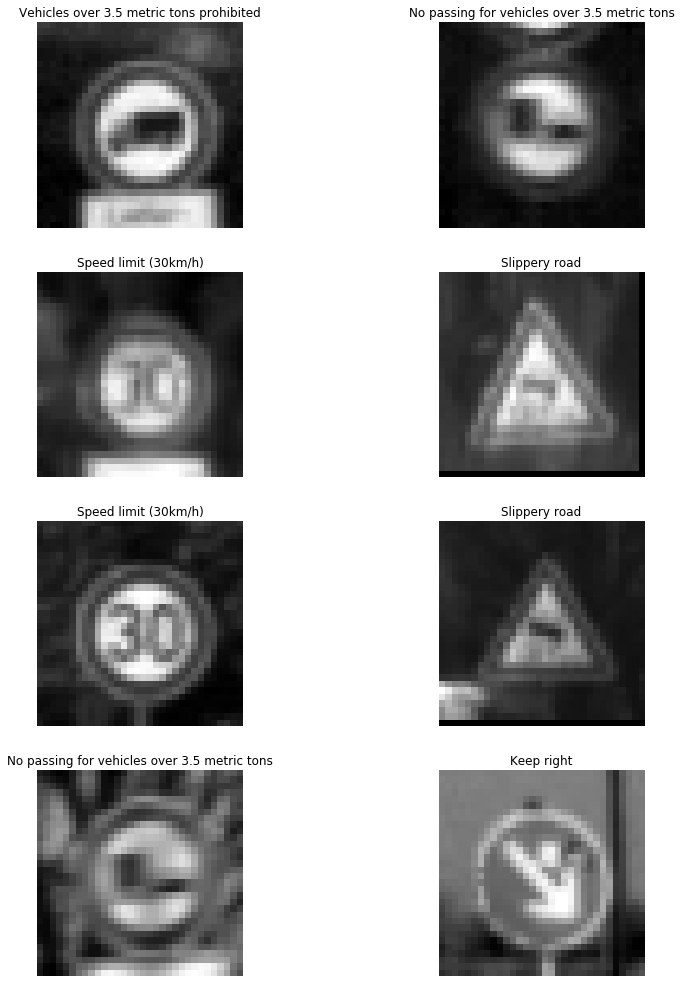

#### 3. Describe, and identify where in your code, what your final model architecture looks like including model type, layers, layer sizes, connectivity, etc.) Consider including a diagram and/or table describing the final model.

My final model consisted of the following layers:

| Layer         		|     Description	        					|
|:---------------------:|:---------------------------------------------:|
| Input         		| 32x32x1 grayscale image   							|
| Convolution 5x5     	| 2x2 stride, valid padding, outputs 28x28x6 	|
| RELU					|												|
| Max pooling	      	| 2x2 stride,  outputs 14x14x6 				|
| Convolution 5x5	    | 2x2 stride, valid padding, outputs 10x10x16    |
| RELU					|												|
| Max pooling	      	| 2x2 stride,  outputs 5x5x16 				|
| Convolution 1x1	    | 2x2 stride, valid padding, outputs 1x1x412    |
| RELU					|												|
| Fully connected		| input 412, output 122        									|
| RELU					|												|
| Dropout				| 50% keep        									|
| Fully connected		| input 122, output 84        									|
| RELU					|												|
| Dropout				| 50% keep        									|
| Fully connected		| input 84, output 43        									|

#### 4. Describe how, and identify where in your code, you trained your model. The discussion can include the type of optimizer, the batch size, number of epochs and any hyperparameters such as learning rate.

The code for training the model is located in the 14th to 16th cell of the ipython notebook.

To train the model, I used an LeNet for the most part that was given, but I did add an additional convolution without a max pooling layer after it like in the udacity lesson.  I used the AdamOptimizer with a learning rate of 0.00097.  The epochs used was 27 while the batch size was 156.  Other important parameters I learned were important was the number and distribution of additional data generated.  I played around with various different distributions of image class counts and it had a dramatic effect on the training set accuracy.  It didn't really have much of an effect on the test set accuracy, or real world image accuracy.  Even just using the default settings from the Udacity lesson leading up to this point I was able to get 94% accuracy with virtually no changes on the test set.  When I finally stopped testing I got 94-95.2% accuracy on the test set though so I think the extra data improved training accuracy, but not a huge help for test set accuracy.  Although this did help later on with the images from the internet.

#### 5. Describe the approach taken for finding a solution. Include in the discussion the results on the training, validation and test sets and where in the code these were calculated. Your approach may have been an iterative process, in which case, outline the steps you took to get to the final solution and why you chose those steps. Perhaps your solution involved an already well known implementation or architecture. In this case, discuss why you think the architecture is suitable for the current problem.

My final model results were:
* training set accuracy of 100.0%
* validation set accuracy of 99.3%
* test set accuracy of 94.2%

If an iterative approach was chosen:
* What was the first architecture that was tried and why was it chosen?
  *  I used a very similar architecture to the paper offered by the instructors.  I used it because they got such a good score the answer was given through it.
* What were some problems with the initial architecture?
  *  The first issue was lack of data for some images and the last was lack of knowledge of all the parameters.  After I fixed those issues the LeNet model given worked pretty well with the defaults.  I still couldn't break 98% very easily until I added another convolution.  After that it was much faster at reaching higher accuracy scores.
* How was the architecture adjusted and why was it adjusted?
  * Past what was said in the previous question, I didn't alter much past adding a couple dropouts with a 50% probability.
* Which parameters were tuned? How were they adjusted and why?
  * Epoch, learning rate, batch size, and drop out probability were all parameters tuned along with the number of random modifications to generate more image data was tuned.  For Epoch the main reason I tuned this was after I started to get better accuracy early on I lowered the number once I had confidence I could reach my accuracy goals.  The batch size I increased only slightly since starting once I increased the dataset size.  The learning rate I think could of been left at .001 which is as I am told a normal starting point, but I just wanted to try something different so .00097 was used.  I think it mattered little.  The dropout probability mattered a lot early on, but after awhile I set it to 50% and just left it.  The biggest thing that effected my accuracy was the data images generated with random modifications.  This would turn my accuracy from 1-10 epochs from 40% to 60% max to 70% to 90% within the first few evaluations. Increasing the dataset in the correct places really improved the max accuracy as well.
* What are some of the important design choices and why were they chosen? I think I could go over this project for another week and keep on learning.  I think this is a good question and I could still learn more about that.  I think the most important thing I learned was having a more uniform dataset along with enough convolutions to capture features will greatly improve speed of training and accuracy.

### Test a Model on New Images

#### 1. Choose five German traffic signs found on the web and provide them in the report. For each image, discuss what quality or qualities might be difficult to classify.

Here are five German traffic signs that I found on the web:

I used semi-easy images to classify and even modified them slightly.  I made them all uniform in size and only had one partially cut off.

#### 2. Discuss the model's predictions on these new traffic signs and compare the results to predicting on the test set. Identify where in your code predictions were made. At a minimum, discuss what the predictions were, the accuracy on these new predictions, and compare the accuracy to the accuracy on the test set (OPTIONAL: Discuss the results in more detail as described in the "Stand Out Suggestions" part of the rubric).

####2. Discuss the model's predictions on these new traffic signs and compare the results to predicting on the test set. Identify where in your code predictions were made. At a minimum, discuss what the predictions were, the accuracy on these new predictions, and compare the accuracy to the accuracy on the test set (OPTIONAL: Discuss the results in more detail as described in the "Stand Out Suggestions" part of the rubric).

Here are the results of the prediction:

The model was able to correctly guess 5 of the 5 traffic signs, which gives an accuracy of 100%. This compares favorably to the accuracy on the test set although I did throw it a softball.

#### 3. Describe how certain the model is when predicting on each of the five new images by looking at the softmax probabilities for each prediction and identify where in your code softmax probabilities were outputted. Provide the top 5 softmax probabilities for each image along with the sign type of each probability. (OPTIONAL: as described in the "Stand Out Suggestions" part of the rubric, visualizations can also be provided such as bar charts)

### Model Architecture

### Train, Validate and Test the Model

A validation set can be used to assess how well the model is performing. A low accuracy on the training and validation
sets imply underfitting. A high accuracy on the training set but low accuracy on the validation set implies overfitting.

    (?, 28, 28, 6)
    (?, 14, 14, 6)
    
    (?, 10, 10, 16)
    (?, 5, 5, 16)
    
    (?, 1, 1, 412)
    (?, 1, 1, 412)
    

    Training...
    
    EPOCH 1 ...
    Test Accuracy = 0.907
    Validation Accuracy = 0.790
    
    EPOCH 2 ...
    Test Accuracy = 0.968
    Validation Accuracy = 0.909
    
    EPOCH 3 ...
    Test Accuracy = 0.985
    Validation Accuracy = 0.949
    
    EPOCH 4 ...
    Test Accuracy = 0.987
    Validation Accuracy = 0.959
    
    EPOCH 5 ...
    Test Accuracy = 0.993
    Validation Accuracy = 0.968
    
    EPOCH 6 ...
    Test Accuracy = 0.993
    Validation Accuracy = 0.969
    
    EPOCH 7 ...
    Test Accuracy = 0.996
    Validation Accuracy = 0.975
    
    EPOCH 8 ...
    Test Accuracy = 0.997
    Validation Accuracy = 0.981
    
    EPOCH 9 ...
    Test Accuracy = 0.998
    Validation Accuracy = 0.980
    
    EPOCH 10 ...
    Test Accuracy = 0.998
    Validation Accuracy = 0.985
    
    EPOCH 11 ...
    Test Accuracy = 0.998
    Validation Accuracy = 0.986
    
    EPOCH 12 ...
    Test Accuracy = 0.999
    Validation Accuracy = 0.989
    
    EPOCH 13 ...
    Test Accuracy = 0.999
    Validation Accuracy = 0.987
    
    EPOCH 14 ...
    Test Accuracy = 0.999
    Validation Accuracy = 0.989
    
    EPOCH 15 ...
    Test Accuracy = 0.996
    Validation Accuracy = 0.988
    
    EPOCH 16 ...
    Test Accuracy = 0.999
    Validation Accuracy = 0.987
    
    EPOCH 17 ...
    Test Accuracy = 0.999
    Validation Accuracy = 0.990
    
    EPOCH 18 ...
    Test Accuracy = 0.999
    Validation Accuracy = 0.990
    
    EPOCH 19 ...
    Test Accuracy = 0.999
    Validation Accuracy = 0.990
    
    EPOCH 20 ...
    Test Accuracy = 1.000
    Validation Accuracy = 0.990
    
    EPOCH 21 ...
    Test Accuracy = 0.999
    Validation Accuracy = 0.990
    
    EPOCH 22 ...
    Test Accuracy = 0.998
    Validation Accuracy = 0.986
    
    EPOCH 23 ...
    Test Accuracy = 1.000
    Validation Accuracy = 0.992
    
    EPOCH 24 ...
    Test Accuracy = 1.000
    Validation Accuracy = 0.986
    
    EPOCH 25 ...
    Test Accuracy = 1.000
    Validation Accuracy = 0.993
    
    EPOCH 26 ...
    Test Accuracy = 0.999
    Validation Accuracy = 0.991
    
    EPOCH 27 ...
    Test Accuracy = 1.000
    Validation Accuracy = 0.994
    
    Model saved

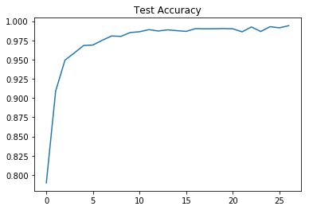

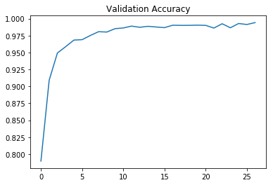

    Train Accuracy = 1.000
    Valid Accuracy = 0.994
    Test Accuracy = 0.949

## Step 3: Test a Model on New Images

To give yourself more insight into how your model is working, download at least five pictures of German traffic signs from the web and use your model to predict the traffic sign type.

You may find `signnames.csv` useful as it contains mappings from the class id (integer) to the actual sign name.

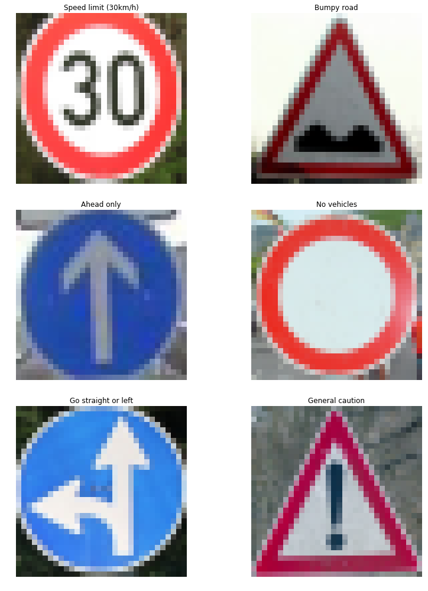

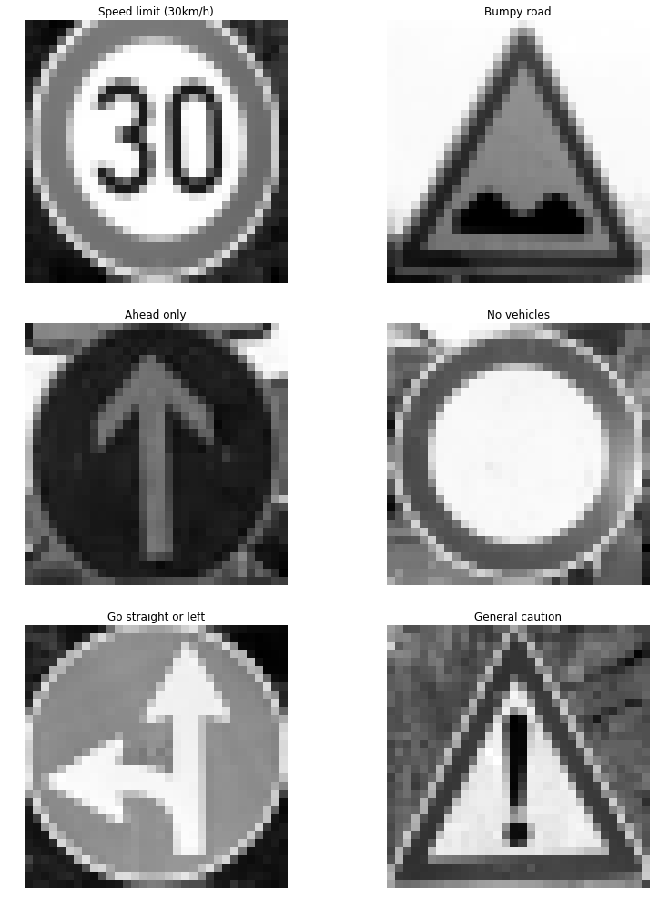

### Predict the Sign Type for Each Image

    My Data Set Accuracy = 1.000

### Analyze Performance

    Image 1
    Image Accuracy = 1.000
    
    Image 2
    Image Accuracy = 1.000
    
    Image 3
    Image Accuracy = 1.000
    
    Image 4
    Image Accuracy = 1.000
    
    Image 5
    Image Accuracy = 1.000
    
    Image 6
    Image Accuracy = 1.000
    

### Output Top 5 Softmax Probabilities For Each Image Found on the Web

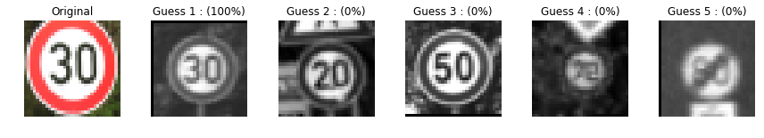

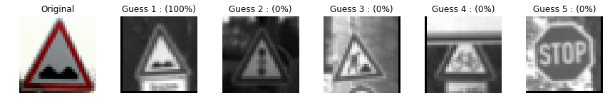

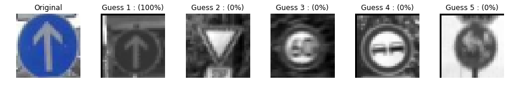

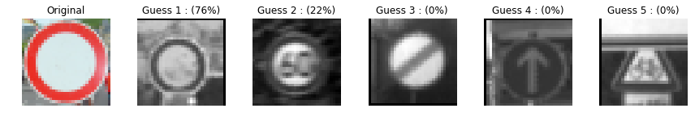

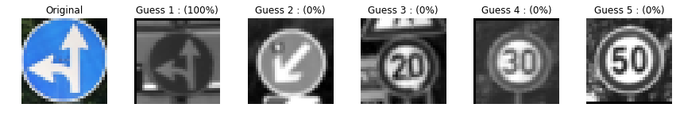

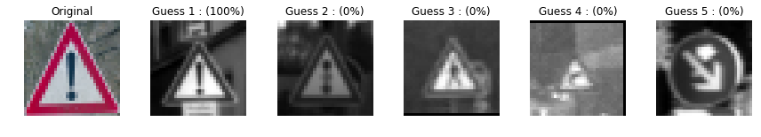

